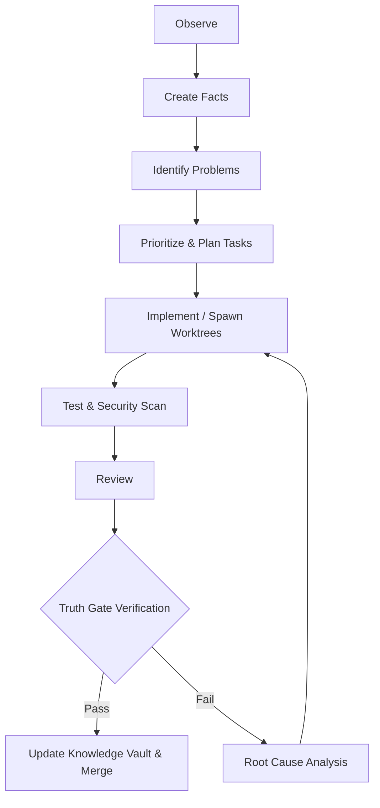

# Architecture

## 5-Layer Stack

1. **User / CLI** (`Typer` in Python)
2. **Orchestrator** (MAS + Task Planner, coordinates dynamic execution)
3. **Core Services**
   - **Knowledge Vault:** SQLite (Machine State) + Obsidian Markdown (Human Readable).
   - **Code Graph:** Headless Language Servers (LSP) instead of static AST parsers.
   - **Tool Layer:** Playwright, GitHub APIs, pytest, OpenTelemetry.
4. **Agent Execution Sandbox**
   - Execute (in Docker) -> Test (Idempotent) -> Verify -> Review
5. **Evidence Store**
   - Stores proof of Truth Gate validations (network logs, traces).

## Execution Flow (The Loop)

## Knowledge Vault
A unified persistence layer handling:
- **Project Identity:** Stack, constraints, goals.
- **Architecture Decisions:** Why certain tech was chosen.
- **Incidents:** Failures to prevent repeating mistakes.
- **Evidence:** Links to raw data proving facts (Traces, Screenshots).

## The Analytics Playground Architecture
This project is an **Autonomous Data Analysis Playground**. It is structurally designed to ingest external data (GA4, GSC, Trends) and synthesize optimizations (AEO/GEO) entirely in isolation.

**Data Flow:**
1. **Ingest**: Read from external APIs via specialized agents.
2. **Synthesize**: LLM processing to generate AEO schema payloads.
3. **Validate**: Local validation using MCPs (Rich Results Test).
4. **Export**: Final payloads are exported to the local `/report` directory.
